# SHAM-7X0

Sharp Handheld ApproxiMation: a proof of concept emulator for the Sharp OZ-750 and ZQ-770 organisers, running the real firmware behind a realistic-looking front-end (bezel, keyboard, LCD simulation).

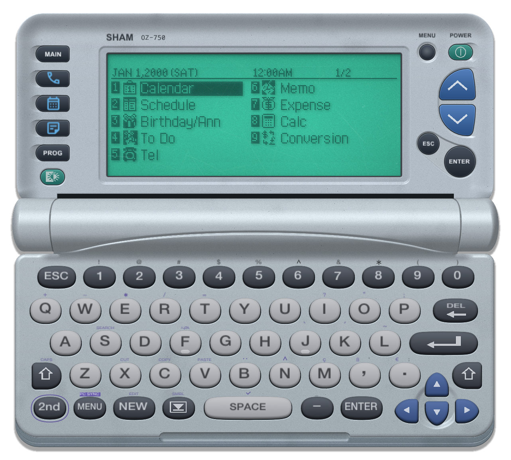

The firmware is not included. Put one or both of these in the ROM folder, `$XDG_DATA_HOME/sham7x0/rom` (default `~/.local/share/sham7x0/rom`). They're recognised by size and SHA-256, so any file name works:

| Firmware | Size | SHA-256 | Emulated as |
|---|---|---|---|
| OS 1.62: `r162.da1` from the Sharp System Update Utility v1.62 | 589824 | `a66c0b0e602464d44e1fb5083fb0e2b6e8d28ae920016875abfc51222c9b8311` | OZ-750 |
| OS 2.1: pages 000-047 of a ZQ-770's flash | 589824 | `e56c8391f94f579505d41c3d05d0b103801cb340648c4c79e9898b44ec19812a` | ZQ-770 |

Pick between them in Emulation > Firmware. `--rom=FILE` runs any image, known or not. If the ROM folder is empty, `./rom` is tried too.

Files:

| Path | Contents |
|---|---|
| `$XDG_CONFIG_HOME/sham7x0/emu.ini` (`~/.config/sham7x0`) | window, view and emulation settings, and the firmware last picked |
| `$XDG_DATA_HOME/sham7x0/rom/` (`~/.local/share/sham7x0`) | firmware images |
| `$XDG_DATA_HOME/sham7x0/state/` | saved machines: `state-os1.62.bin`, `state-os2.1.bin`, or `state-<file name>.bin` for an unknown `--rom` |

`--data=DIR` keeps all three in `DIR` (`DIR/emu.ini`, `DIR/rom/`, and the state files in `DIR`) instead.

A saved machine holds the CPU registers, the hardware state (ports, windows, interrupts, RTC, UART, flash command state), all emulated SRAM, and the flash data area from page 048 up, totalling about 3.9MB. The firmware pages 000-047 aren't saved; they come from the ROM file on each launch. A save is only compatible with the firmware it was made with.

`--model=OZ-750|ZQ-770` overrides the hardware the firmware runs on; it also sets the model printed on the case. The ZQ-770 has one 128KB SRAM mirrored across pages 400-4FF, nothing at 500 (open bus), the UART mirrored at ports 48-4F, undecoded ports reading as open bus, and port 12 reading F8. OS 2.1 ignores the keyboard unless port 12 bit 4 is set.

## Build

SDL3 and the imgui submodule, on macOS, Linux or Windows (MSYS2 UCRT64).

```
git submodule update --init
brew install sdl3                  # macOS
sudo apt install libsdl3-dev       # Ubuntu 25.04 or later
pacman -S make mingw-w64-ucrt-x86_64-gcc mingw-w64-ucrt-x86_64-pkgconf mingw-w64-ucrt-x86_64-sdl3   # MSYS2 UCRT64
make
make run
make headless   # CLI harness: run N seconds, dump the screen
make dist       # dist/sham7x0-<os>-<arch>.zip with the binaries, assets, licences and, on macOS and Windows, SDL3
```

The Linux package uses the system SDL3 (`libsdl3-0`). GitHub Actions builds all three packages as artifacts.

On macOS the menus are in the menu bar with Cmd shortcuts. On Linux and Windows, right-click the window (or press the Menu key) for the same menus, and use Alt where this README says Cmd. Settings and data live in `%APPDATA%\sham7x0` and `%LOCALAPPDATA%\sham7x0` on Windows. Serial ports are `/dev/cu.*` on macOS, `/dev/ttyUSB*` and `/dev/ttyACM*` on Linux and `COMn` on Windows. Windows has no virtual port; pair two ports with com0com instead.

`make TOUCHSCREEN=1` (macOS only) adds View > Touchscreen Mode and `--touchscreen[=NAME]`, which cover a TETRA USB touch display (or the display named `NAME`) with the device and read its touch panel through IOKit.

## First run

A blank machine reports "memory not initialized". Choose Run > Initialize Memory (or type `init` in the console) to reset with ON held, then press ENTER to initialise. The setup wizard follows.

| Not initialized | Initialize Memory | Setup wizard |
|---|---|---|
| 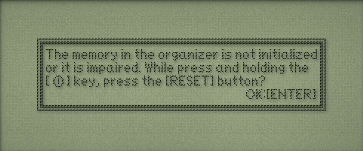 | 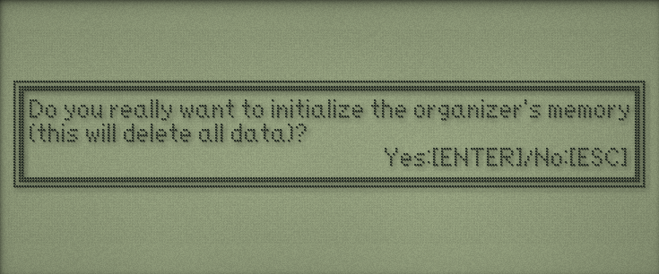 | 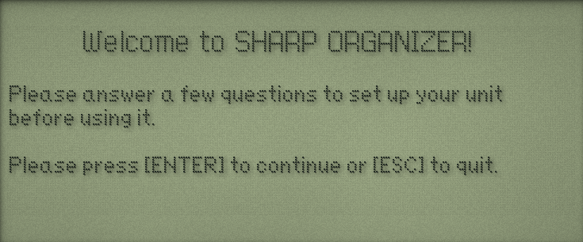 |

Console commands: `reset`, `init`, `testmode`, `on`, `install PATH`, `save`, `pc`, `trace on`, `trace off`. Run > Factory Test Mode (or `testmode`) resets with ESC+D held, which opens the firmware's factory test menus. The lid up/down keys change page and digits pick a test. Cmd-R resets back out; like any reset, that goes through the contrast screen first. Some tests (RAM FILL, the FLASH ROM items, CLEAR ADDIN AREA) overwrite memory. Cmd-R resets, the bezel POWER key presses ON.

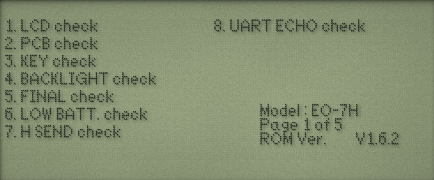

The machine state is saved to the firmware's state file on exit and every minute, and restored on launch with the clock advanced by the time away. `--fresh` ignores it. Screenshot runs don't touch it.

Clicked keyboard keys go straight to the key matrix, so Shift, 2nd and CAPS behave as the firmware decides. A clicked left Shift stays down until the next key. Host typing and the bezel keys are translated to matrix presses.

The LCD draws at whole pixel scales; the window snaps to the nearest size that fits the device, no smaller than the smallest scale. With the console shown, width sets the device size and height the console.

View > Borderless (Cmd-Shift-B, `--borderless`) drops the window frame and background so only the device sits on the desktop, sized to the current layout. Drag it by the case, or by the LCD in Screen Only. The console is hidden while it's on; Show Console or Focus Console turns it off.

View > Compact (`--compact`) drops the hinge and joins the lid and keyboard at a groove for a tighter layout. Touchscreen Mode always uses it.

```
./sham7x0 --exec=init --keys="{WAIT}...{ENTER}"
./headless rom/r162.da1 --seconds=10 --keys=0:99.0/1.5,2:6.6/0.3 --pbm=out.pbm
./headless rom/os2.1-firmware.bin --model=ZQ-770 --seconds=10 --keys=0:99.0/1.5,4.13:6.6/0.3 --pbm=out.pbm
```

Headless keys are `SECONDS:COLUMN.ROW/HOLD`. Column 99 is the ON key. Headless defaults to `--model=OZ-750`. `--lcd=FILE` saves the final screen through the LCD simulation as a PPM, lit if the firmware has the backlight on, at `--lcd-cell=N` pixels per dot (default 4).

`python3 tools/readme_screenshots.py` regenerates the pictures in `docs/screenshots/`. It builds the test states first and needs the test apps in `apps/`.

`--serial[=TARGET]` connects the UART. A character device such as `/dev/cu.usbmodem1101` is opened as a real serial port, and its baud rate follows the divisor the program sets (WizTerm defaults to 9600). Any other `TARGET` gets a pty symlinked there, and plain `--serial` gets an unlinked pty. Headless runs in real time with it, and `--serial-log=FILE` records the traffic. PC SYNC (2nd, MENU) and WizTerm work against it.

In the emulator, pick a port from Emulation > Serial Port (the list of `/dev/cu.*` devices is refreshed each time it opens), pass `--serial[=TARGET]`, or type `serial TARGET`, `serial pty`, `serial off` or `serial` in the console.

```
./headless rom/r162.da1 --load=STATE --seconds=600 --serial=/tmp/wizard --keys=0.6:0.6/0.2,1.6:1.6/0.2
```

## Screens

| Main menu | Main menu, backlight on |
|---|---|
| 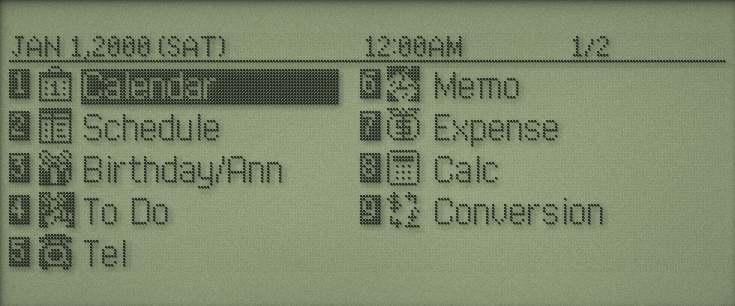 | 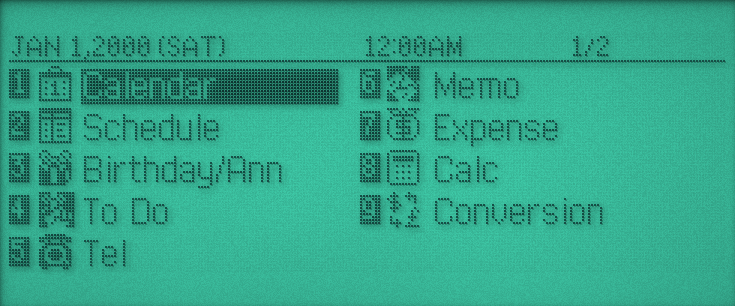 |

| Calendar | World clock | New memo |
|---|---|---|
| 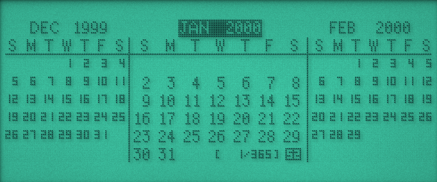 | 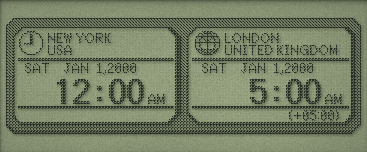 | 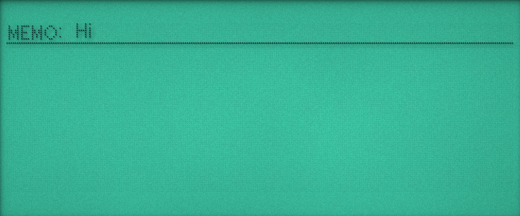 |

## Installing programs

Install > Install .wzd (Cmd-I), `--install=FILE` or the console `install PATH` writes a BASIC or machine code `.wzd` straight into a free My Programs slot. Put test files in `apps/` (ignored by git), sorted into `programs/`, `basic/`, `memo/` and `schedule/` by data type. MEMO and SCHEDULE `.wzd` files are sent the way the PC software did: the emulator presses 2nd, MENU (PC SYNC) and plays the PC side of the link over the emulated UART, so the firmware files the records itself. Transfers queue, run at the organizer's 9600 baud, and show progress above the console (or bottom left when it's hidden) and in the App Browser. `headless --install` does the same.

| My Programs | BASIC: Pegs | Machine code: Pong | Memo sent over PC SYNC |
|---|---|---|---|
| 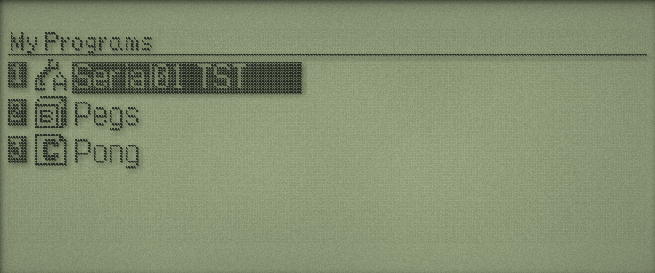 | 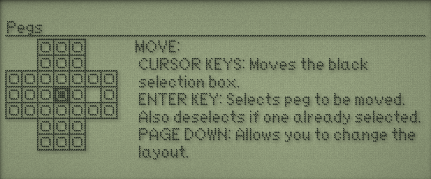 | 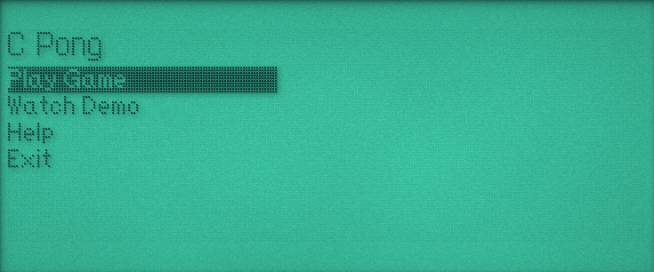 | 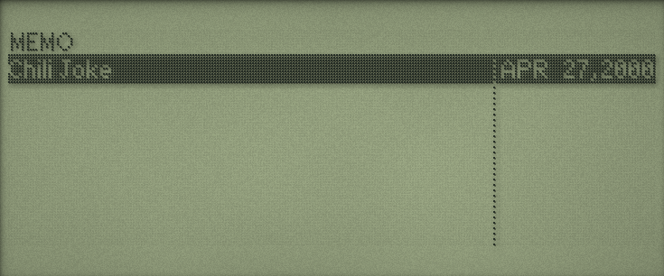 |

### PC SYNC protocol

From the ZQ-770 firmware (command parser at page 39) and a capture on ozdev. Every packet starts `00 00 00 00 00 96`. `82 05` is ENQ, `82 16` SYN, `82 06` ACK, `82 15` NAK. A frame is `81 10`, a block number (`FF FF` for commands, 1, 2, 3... for data), `01 40 FE`, a 16-bit little-endian length, the payload and a 16-bit little-endian sum of the payload bytes. The side with something to say sends ENQ until it gets SYN, then the frame, and the other side ACKs.

Pressing PC SYNC makes the organizer send `WSYS START`. Sending memos is then `WSYS RECEIVE WIZ_ALL S1:` (answered with the model and owner), `WDAT SEND`, the data stream in numbered blocks, `1A`, and `WSYS RESET` (answered `OK`). Command words come from a table at 0x7342a: `WFIL`, `WDAT`, `WSYS`, `WADN`, `WBAS`, each with its own sub-commands.

The data stream is `"F","S1:MEMO.BOX"` (or `SCHEDUL1.BOX`, `ANNIV1.BOX`, `TODO.BOX`, `ADDRESS.BOX`, `EXPENSE.BOX`) and CRLF, then an `"IT",` item header and one `"D",` block per record. Each block is its tag, a 32-bit big-endian length of the rest and a trailing CRLF. `IT` holds a field count, then per field its type, 4-letter ID and name. `D` holds three words (0, the PC ID or FFFF for none, FF80), a 32-bit length, a field count, the field lengths and the fields. The memo box has `ATTR DATE TTL1 MEM1` and schedule `ATTR TIM1 TIM2 ALRM MEM1`. `ATTR` is one byte, `80` for not secret. Dates are year (16-bit), month, day, hour, minute and `FF FF`, with `FF` for no time. The title is padded to 20 characters and line breaks are CR. `WDAT RECEIVE MEMO.BOX` returns the same format.

Install > App Browser (Cmd-Shift-I, `--menu=apps`) opens a separate window that searches the `index.json` in each of those directories by title, description and category, shows the screenshot and installs the selected program, memo or schedule. Up/Down and Page Up/Down move the selection, Enter or a double-click installs. Each `index.json` is an array of objects with `file`, `original_file`, `title`, `data_type`, `category`, `description`, `alert`, `source_url` and `screenshot` (relative to the directory).

A slot is 32KB at page 60 + 4n, ten total:

| Offset | Content |
|---|---|
| 00 | type, 40 for a program. Deleting clears bit 6 |
| 08 | offset of the file name record: 2 bytes, then the name |
| 0A | offset of the title record: 1 byte, then the NUL terminated title |
| 0C | offset of the program record: 1 byte, 16-bit length, then the tokenized program |
| 0E | slot id, 101 + slot |
| 10 | icon block from `<BIN>`: length, then a 12x12 bitmap |

The `<BIN>` payload is the icon block followed by the tokenized program. Bytes 01-07 and the record lead bytes are written as zero; the firmware doesn't read them.

## Hardware notes

From the firmware, [ozdev](https://github.com/arpruss/ozdev), and measurements on a ZQ-770 (wizard-dev `HARDWARE.md`).

| Area | Detail |
|---|---|
| CPU | Z80, IM 1, 9.8304 MHz (per MAME) |
| 0000-7FFF | flash offset 0 |
| 8000-9FFF | 8KB page from ports 1/2, physical page = value + 4 |
| A000-BFFF | 8KB page from ports 3/4, physical page = value |
| C000-FFFF | fixed RAM pages 402-403 |
| Pages 000-17F | flash, firmware in 000-047, data from 048. 180-1FF mirror 100-17F |
| Page 300 | LCD control word: bit 7 on, bit 6 blank, bits 0-5 contrast, bit 8 backlight (the firmware clears it about a minute after the last key, when 0xC00D reaches 60; View > Realism > Backlight Timeout lets it, off by default) |
| Pages 400+ | RAM, display at 400 or 404 (port 22/23) |
| Ports 5/6/7 | interrupt status / acknowledge / mask. Bit 0 keyboard, 2 UART, 4 1Hz RTC, 5 64Hz tick, 7 ON key |
| Port 8 | sleep before HALT |
| Ports 10/11/12 | keyboard rows / columns 0-7 / columns 8-10. Keycode table at 0x23a3 (1.62) or 0x2400 (2.1). Column 9 rows 0-4 are MAIN, TEL, CAL, MEMO, PROG |
| Port 12 read | status inputs: E8 on the OZ-750 model, F8 as measured on a ZQ-770 (bits 7, 6, 5, 4, 3). OS 2.1 needs bit 4 |
| Port 46 bit 4 | ON key |
| Ports 30-3F | RP5C01-style RTC, one BCD nibble per register |
| Ports 16-19 | sound: 19 tone mode, 17/18 divisor, 16 bit 0 on. 16384 / (divisor + 2) Hz |
| Ports 40-47 | 8250 UART, 153600 / divisor baud. PC SYNC polls THRE to send and takes receive interrupts |
| Flash | Intel/Sharp command set (FF, 40, 20/D0, 50, 60, 70, 90), 64KB erase blocks, ID 89/A6 |
| RAM | OZ-750: pages 400-40F and 500-50F (firmware maps 410-41F to 500-50F). ZQ-770: 400-40F mirrored over 400-4FF, open bus from 500 |
| Open bus | ZQ-770 reads of unmapped pages, page 300 and undecoded ports return the last data bus byte (7E after `ld a,(hl)`, 78 after `in a,(c)`) |
| Layout | system to 0BFFFF, add-ons 0C0000-10FFFF, data 110000-2EFFFF, marker at 2F0000 |

## Not done

- Port 12 status inputs always report battery and switch OK.
- After initialising, OS 2.1 sets the date to Jan 1, 2001 (1.62 uses 2000); the wizard-dev firmware comparison found the constant change.
- The UART doesn't check parity. PC SYNC runs 8O1 on real hardware, so frames the emulator accepts at 8N1 would be rejected by a real Wizard.
- The CPU runs at 9.8304 MHz (per MAME). A ZQ-770 measured 9.09 MHz with no wait states, while its UART, tick and RTC keep their own clocks.
- IrDA is a stub. The UART has no modem status inputs besides the ON key, and never overruns or reports line errors.
